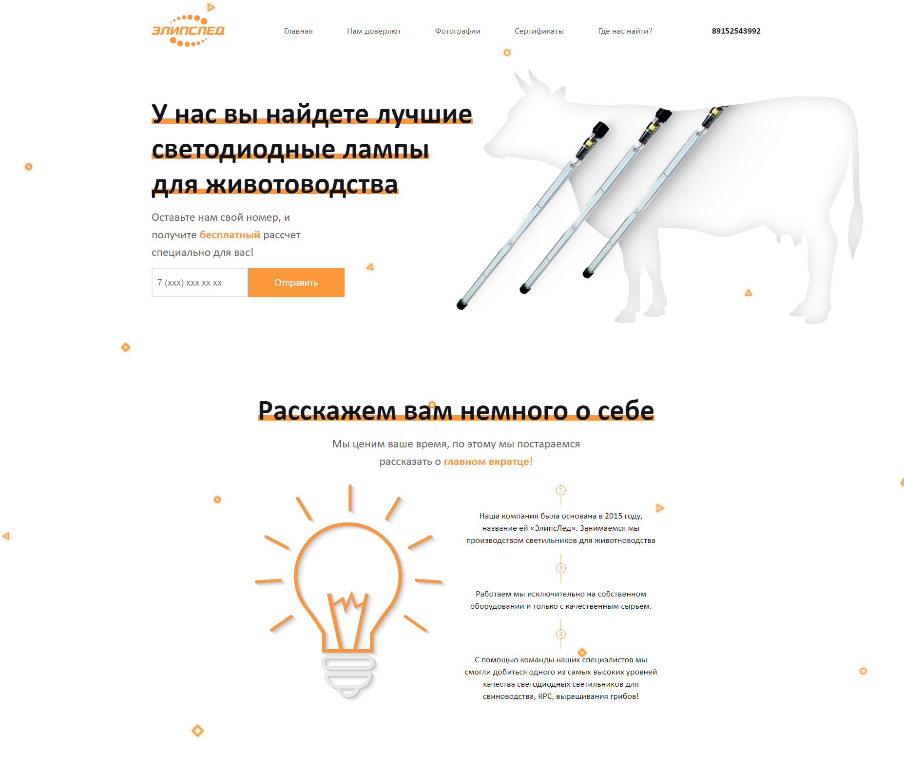

# Elipsled

Elipsled is an adaptive cross-browser website page that I made as a test assignment for a company. You can look at this
link: https://daniilsintsov.github.io/portfolio/Elipsled/

**Note:** the *gulp-assembly* folder contains the project source files

## Screenshot:

