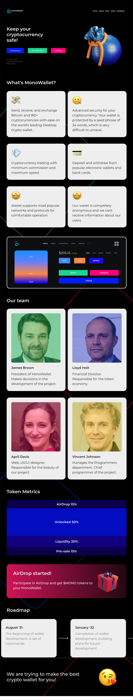

# MonoWallet

MonoWallet is an adaptive cross-browser website presenting a cryptocurrency wallet. You can look at this
link: https://daniilsintsov.github.io/portfolio/MonoWallet/

**Note:** the *gulp-assembly* folder contains the project source files

## Screenshot:

