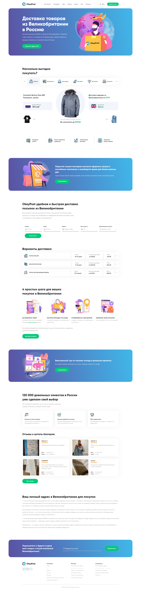

# OkeyPost

    

OkeyPost is an adaptive cross-browser website presenting an online store that sells products from the UK at a discount.
You can look at this link: https://daniilsintsov.github.io/portfolio/OkeyPost/

**Note:** the *gulp-assembly* folder contains the project source files
