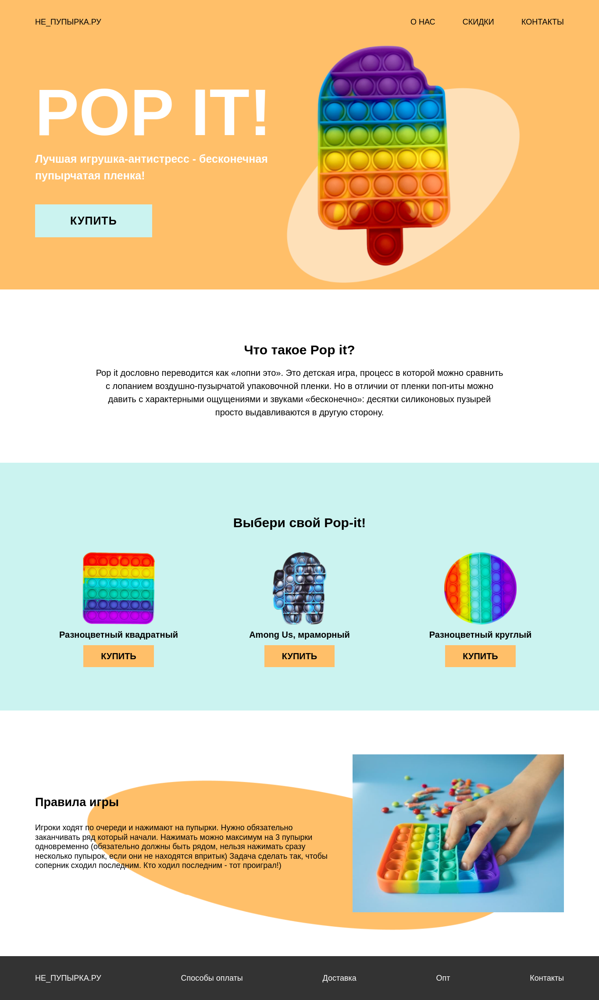

# Pop-it

    

Pop-it is an adaptive cross-browser website presenting an anti-stress toy. The task was to layout this simple page using
only HTML and CSS. You can look at this link: https://daniilsintsov.github.io/portfolio/Pop-it/
